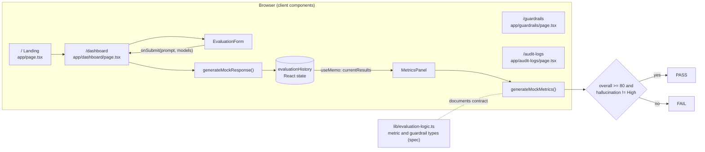

# TrustLLM

**Evaluate, compare and gate LLM responses against quality and safety guardrails before they reach users.**

TrustLLM is a Next.js front end for an LLM evaluation and governance workflow: send one prompt to several models, score each response on grounding, hallucination risk, confidence, consistency and toxicity, and get a pass/fail deployment decision with an audit trail. The current build is a fully interactive prototype. Model responses and metrics are simulated in the browser, so it runs with no API keys.

| | |
|---|---|
| Repository | [github.com/Professional50coder/trustllm](https://github.com/Professional50coder/trustllm) |
| Live demo | No hosted deployment is referenced in the repository. Run it locally and open `/dashboard` (see [Running locally](#16-running-locally)). |
| Design docs | [SYSTEM_ARCHITECTURE.md](./SYSTEM_ARCHITECTURE.md), [ARCHITECTURE_DIAGRAMS.md](./ARCHITECTURE_DIAGRAMS.md), [QUICK_REFERENCE.md](./QUICK_REFERENCE.md), [ENHANCEMENTS.md](./ENHANCEMENTS.md), [VISUAL_GUIDE.md](./VISUAL_GUIDE.md), [ENHANCEMENT_SUMMARY.txt](./ENHANCEMENT_SUMMARY.txt) |
| Metric spec | [lib/evaluation-logic.ts](./lib/evaluation-logic.ts) |

**At a glance**

- **Side-by-side evaluation** of up to 4 models (GPT-4, GPT-3.5 Turbo, Mistral 7B, Claude 3 Opus) per prompt, with per-model cost and time estimates before you run.
- **Metrics plus guardrails**: continuous 0-100 scores for diagnosis, binary pass/fail rules for the deployment decision.
- **Client-only prototype**: Next.js 16 App Router, React 19, TypeScript, Tailwind and shadcn/ui; no backend, no database, no external API calls.

## Contents

1. [The problem we solve](#2-the-problem-we-solve)
2. [Why we built it](#3-why-we-built-it)
3. [What it does](#4-what-it-does)
4. [Use cases](#5-use-cases)
5. [Product tour](#6-product-tour)
6. [How it works](#7-how-it-works)
7. [Architecture](#8-architecture)
8. [Models and scoring](#9-models-and-scoring)
9. [Design decisions](#10-design-decisions)
10. [Feature matrix](#11-feature-matrix)
11. [Trust, security and limits](#12-trust-security-and-limits)
12. [Where it stands](#13-where-it-stands)
13. [Tech stack](#14-tech-stack)
14. [Repository layout](#15-repository-layout)
15. [Running locally](#16-running-locally)
16. [Testing](#17-testing)
17. [Deploying](#18-deploying)
18. [Roadmap](#19-roadmap)
19. [Documentation index](#documentation-index)

---

## 2. The problem we solve

Teams shipping LLM features need to answer one question before release: is this model's output safe and accurate enough for our users? In practice that answer is assembled by hand, by pasting the same prompt into several providers, eyeballing the answers, and keeping no record of why one was approved.

That leaves three gaps:

- **No common yardstick.** Responses from different models are compared on impression, not on the same set of measures.
- **No explicit release bar.** "Good enough" is not written down as rules (minimum grounding, maximum hallucination risk, no unsafe content), so it drifts between reviewers.
- **No audit trail.** There is no log of which prompt, model, scores and decision led to a deployment, which matters most in regulated settings.

## 3. Why we built it

TrustLLM started as a landing page and a simple dashboard and was expanded into a full evaluation workflow (see [ENHANCEMENTS.md](./ENHANCEMENTS.md) and [ENHANCEMENT_SUMMARY.txt](./ENHANCEMENT_SUMMARY.txt)). The goal was to model the whole loop (prompt, multi-model responses, metrics, guardrails, audit) as a working interface, and to document the reasoning behind each choice, not just the code. The scoring engine is deliberately mocked so the product shape, data contracts and UX can be reviewed without API keys, and so a real evaluation service can be dropped in behind the same interfaces later.

## 4. What it does

| Capability | Problem removed |
|---|---|
| Multi-model playground: one prompt, up to 4 models, results stacked for comparison | Copy-pasting the same prompt across provider consoles |
| Per-model cost (`$/call`) and a cost warning above $0.05 per evaluation | Running expensive model combinations without noticing |
| Estimated run time, live character counter (10-2000 chars), inline validation | Submitting empty or truncated prompts |
| Six-signal metrics panel: grounding, hallucination risk, confidence, consistency, toxicity, answer length | Judging responses on impression |
| Composite overall score with PASS/FAIL badge per model | No single release decision per response |
| Guardrail checklist inside each result (grounding >= 80%, consistency >= 85%) | Not knowing which rule a response failed |
| Guardrail rule management page (toggle, delete, rule categories) | Release criteria living in people's heads |
| Audit log with search, model and status filters, pass rate and pending-review counts | No record of what was evaluated and decided |
| In-session history tab: total evaluations, pass rate, models tested, response length per run | Losing earlier results when re-running a prompt |

## 5. Use cases

- **Model selection.** Compare GPT-4, GPT-3.5 Turbo, Mistral 7B and Claude 3 Opus on your own prompt, weighing score against per-call cost.
- **Pre-release gating.** Define a release bar (minimum grounding, hallucination ceiling, unsafe-content block, citations) and see which responses clear it.
- **Compliance review.** Use the audit log to show which prompts were evaluated, by which model, with which scores and review status.
- **Prototype and spec reference.** Use the UI and `lib/evaluation-logic.ts` as a working specification for building a real evaluation service.

## 6. Product tour

| Route | Source | What you see |
|---|---|---|
| `/` | `app/page.tsx` | Landing page: feature overview, four-step "How it works", architecture section, calls to action |
| `/dashboard` | `app/dashboard/page.tsx` | Main evaluation interface with three tabs: **Playground**, **Guardrails**, **History** |
| `/guardrails` | `app/guardrails/page.tsx` | Rule configuration: five default rules (Require Citations, Block Unsafe Content, Minimum Grounding Score, Toxicity Threshold, Answer Consistency), toggle and delete, "Add New Guardrail Rule" form |
| `/audit-logs` | `app/audit-logs/page.tsx` | Evaluation history table with search, model filter, PASS/FAIL filter, pass rate, pending-review count and an Export CSV button |

**Try it**

1. Go to `/dashboard`.
2. Enter a prompt (minimum 10 characters).
3. Select models to evaluate (GPT-4 and GPT-3.5 Turbo are pre-selected; up to 4).
4. Click **Run Evaluation**.
5. Review each model's metrics, overall score and guardrail status. Switch to **History** to see the session log.

Color coding throughout: green means safe or passing, yellow means caution, red means alert or failing.

## 7. How it works

One evaluation, end to end, as implemented today:

1. **Input and validation** (`components/evaluation-form.tsx`). The form tracks prompt length (max 2000), enforces at least 10 characters and at least one model, caps selection at 4, sums `costPerCall` across selected models and shows a warning above $0.05. Estimated time is `models x (ceil(chars / 50) + 2)` seconds.
2. **Submit** calls `onSubmit(prompt, models)`, wired to `handleEvaluation` in `app/dashboard/page.tsx` (a `useCallback`).
3. **Simulated inference.** `handleEvaluation` sets loading state, waits `min(models x 500 ms, 2000 ms)` to mimic parallel API latency, then calls `generateMockResponse(modelId, prompt)` per model. Each model has its own response template (GPT-4 structured and evidence-heavy, GPT-3.5 shorter, Mistral applied, Claude hedged and nuanced), with the prompt interpolated.
4. **History update.** Results are typed as `EvaluationResult { modelId, modelName, response, timestamp, status }` and prepended to `evaluationHistory`, which keeps the newest results plus the previous 9 entries. Errors are caught and logged.
5. **Derived state.** `currentResults` (complete results) and `evaluationStats` are `useMemo` selectors over history.
6. **Scoring** (`components/metrics-panel.tsx`). Each `MetricsPanel` calls `generateMockMetrics(modelId, response)`:
   - Grounding = model baseline + random variance (+/-4 pts) + a length factor (up to 5 pts at 200+ words), capped at 99.
   - Hallucination risk is derived inversely from grounding and bucketed: Low < 5%, Medium < 15%, High otherwise.
   - Confidence = model baseline +/- 5 pts.
   - Consistency = `0.7 x grounding + 0.3 x confidence`, plus 5 pts if the response contains a conclusion marker ("in conclusion", "in summary", "therefore", "ultimately").
   - Toxicity is a random roll: about 75% Low, 10% Medium, 15% High.
   - Overall = `0.4 x grounding + 0.3 x (100 - hallucination risk) + 0.3 x consistency`.
7. **Guardrail decision.** A response is **PASS** when `overallScore >= 80` and hallucination is not High. The panel also shows per-rule checks for grounding >= 80% and consistency >= 85%.

## 8. Architecture



**Components**

| Component | File | Responsibility |
|---|---|---|
| `DashboardPage` | `app/dashboard/page.tsx` | Orchestrates state and workflow; owns history, guardrail config state and statistics; three tabs |
| `EvaluationForm` | `components/evaluation-form.tsx` | Input, validation, model catalogue (`availableModels`), cost and time estimates |
| `MetricsPanel` | `components/metrics-panel.tsx` | Scores one model's response; score bars, hallucination and toxicity badges, guardrail checklist, response preview |
| `Navigation` | `components/navigation.tsx` | Sticky header with links to `#features`, `#how-it-works`, `#architecture` and the dashboard |
| `GuardrailsPage` | `app/guardrails/page.tsx` | Local rule list (`GuardrailRule` with type `citation`, `safety`, `score`, `toxicity`, `custom`) |
| `AuditLogsPage` | `app/audit-logs/page.tsx` | Filters a static set of 8 `AuditLogEntry` records |
| UI primitives | `components/ui/*` | shadcn/ui components built on Radix UI |

**Data contracts**

- `EvaluationResult` (dashboard): `modelId`, `modelName`, `response`, `timestamp`, `status: 'pending' | 'complete' | 'error'`.
- `AuditLogEntry` (audit logs): `id`, `timestamp`, `prompt`, `model`, `groundingScore`, `hallucination`, `toxicity`, `guardrailStatus: 'PASS' | 'FAIL'`, `reviewStatus: 'pending' | 'approved' | 'rejected'`.
- `lib/evaluation-logic.ts` exports the target types `GroundingMetrics`, `ConfidenceMetrics`, `SafetyMetrics`, `ResponseMetrics`, `AllMetrics` and `GuardrailRule` (with a `check(metrics) => { passed, reason, severity }` signature). These are not yet imported by the UI.

**State pattern** (dashboard)

```javascript
// INPUT: What user provides
const [prompt, setPrompt] = useState('')
const [selectedModels, setSelectedModels] = useState([])

// OUTPUT: What system generates
const [evaluationHistory, setEvaluationHistory] = useState([])

// DERIVED: Calculated from output
const currentResults = useMemo(() =>
  evaluationHistory.filter(r => r.status === 'complete')
, [evaluationHistory])
```

There is no server API, route handler or database. Diagrams of the component tree, state flow, metrics flow and user journey are in [ARCHITECTURE_DIAGRAMS.md](./ARCHITECTURE_DIAGRAMS.md).

## 9. Models and scoring

**Model catalogue** (`components/evaluation-form.tsx`). Costs are the configured per-call figures used for estimates; no calls are made.

| ID | Name | Provider | Tier | Cost per call | Baseline grounding / hallucination / confidence |
|---|---|---|---|---|---|
| `gpt4` | GPT-4 | OpenAI | enterprise | $0.0300 | 0.92 / 0.08 / 0.88 |
| `gpt35` | GPT-3.5 Turbo | OpenAI | standard | $0.0010 | 0.85 / 0.15 / 0.80 |
| `mistral` | Mistral 7B | Mistral AI | standard | $0.0001 | 0.88 / 0.12 / 0.82 |
| `claude3` | Claude 3 Opus | Anthropic | enterprise | $0.0150 | 0.90 / 0.10 / 0.85 |

**Why these metrics** (from `lib/evaluation-logic.ts`):

- **Grounding** is the primary signal: a false but well-written answer is worse than a clumsy true one. Bands: 0-30 speculative, 30-70 partially grounded, 70-100 well grounded.
- **Hallucination risk** is reported as a category (Low 0-5%, Medium 5-15%, High 15%+) because reviewers act on levels, not raw probabilities.
- **Confidence** contextualises grounding: high confidence with low grounding is the hallucination pattern to flag.
- **Consistency** checks that the answer is coherent and reaches a conclusion. Bands: 90-100 excellent, 70-90 good, 50-70 adequate, below 50 poor.
- **Toxicity and safety compliance** are treated as gates, not as quality signals.

**Composite score.** Two formulas exist and they differ:

| Where | Formula |
|---|---|
| Implemented (`metrics-panel.tsx`) | `0.4 x grounding + 0.3 x (100 - hallucination risk) + 0.3 x consistency` |
| Specified (`evaluation-logic.ts`) | `0.4 x grounding + 0.3 x consistency + 0.2 x confidence + 0.1 x safety` |

Score interpretation from the spec: 90-100 ready for production, 80-90 minor refinement, 70-80 review before deployment, 60-70 significant refinement, below 60 reject.

## 10. Design decisions

| Decision | Why | Trade-off |
|---|---|---|
| Mock responses and metrics in the client | Reviewable without API keys; each mock varies by model so comparisons are meaningful | Scores are not real measurements and include random variance |
| Metrics separate from guardrails | Users can see a 75% score against an 80% threshold; close misses can go to review, far misses to rejection | Two concepts to configure and explain |
| Multiple metrics, not one score | Different failure modes (fabrication, incoherence, toxicity) need different responses | More UI surface per result |
| Grounding weighted highest (40%) | Factual accuracy is the main release risk | Weights are fixed in code, not calibrated against human feedback |
| Model catalogue as one array | Single source of truth for names, providers, tiers and cost | Templates and baselines live in two other files, so adding a model touches three places |
| `useMemo` / `useCallback` on derived state and handlers | Metrics panels and form avoid unnecessary re-renders as history grows | `MetricsPanel` still recomputes random metrics when it re-renders |
| History capped at newest results + 9 earlier entries | Bounded in-memory state | Older runs are dropped; nothing persists across reloads |
| shadcn/ui on Radix UI, Tailwind design tokens | Accessible primitives and a consistent dark slate/blue theme | Large set of generated UI files under `components/ui/` |

More rationale: [SYSTEM_ARCHITECTURE.md](./SYSTEM_ARCHITECTURE.md) (Design Decisions, Production Considerations).

## 11. Feature matrix

| Feature | Status |
|---|---|
| Prompt validation, char counter, model selection (max 4) | Working |
| Cost estimate and >$0.05 warning, time estimate | Working |
| Per-model simulated responses | Working (mock) |
| Grounding, hallucination, confidence, consistency, toxicity, length | Working (mock) |
| Overall score and PASS/FAIL badge | Working (mock inputs) |
| Dashboard History tab (in session) | Working; dashboard pass/fail counts use a fixed 80/20 split, not per-result outcomes |
| Dashboard Guardrails tab | Display only; switches and Save/Reset buttons are not wired |
| `/guardrails` toggle and delete | Working (local state, not persisted) |
| `/guardrails` add rule, Save | UI only |
| `/audit-logs` search and filters | Working over 8 static entries |
| `/audit-logs` Export CSV, history View / Load More buttons | UI only (CSV export planned) |
| Real LLM calls, persistence, auth, API | Not implemented |

## 12. Trust, security and limits

- **No secrets, no network calls.** The app makes no external API requests and requires no environment variables. No credentials were found in the repository.
- **Scores are illustrative.** Metrics are generated from fixed baselines, response length, keyword checks and `Math.random()`. They should not be used to make real deployment decisions.
- **Audit data is static.** `/audit-logs` shows hard-coded sample entries; dashboard evaluations are not written to it.
- **No persistence or access control.** All state is in React memory and resets on reload; there is no authentication or multi-user model.
- **Build type checks are disabled.** `next.config.mjs` sets `typescript.ignoreBuildErrors: true`, so `npm run build` will not fail on type errors. Run `npx tsc --noEmit` to check types.
- **Landing-page copy is ahead of the code.** The "Enterprise Ready" card on `/` mentions SOC 2, role-based access control, API-first architecture and a 99.9% SLA; none of these exist in this codebase.

## 13. Where it stands

A front-end prototype with two commits on `main` (initial scaffold, then the enhancement pass). The evaluation workflow, metrics display and guardrail UX are complete as an interactive demo. The scoring backend, persistence, authentication and a programmatic API are not built. Moving to production requires database persistence, real model APIs, authentication and error handling; the component boundaries and typed contracts are set up for those additions.

## 14. Tech stack

| Layer | Choice |
|---|---|
| Framework | Next.js 16 (16.1.6) with App Router |
| UI runtime | React 19 (19.2.3 locked) with hooks: `useState`, `useCallback`, `useMemo` |
| Language | TypeScript 5.7 |
| Styling | Tailwind CSS 3.4 with CSS-variable design tokens, `tailwindcss-animate`; dark theme by default |
| Components | shadcn/ui (Radix UI primitives), `lucide-react` icons |
| Fonts | Geist and Geist Mono via `next/font/google` |
| Also installed | `react-hook-form`, `zod`, `recharts`, `sonner`, `next-themes`, `date-fns`, `cmdk`, `vaul` |
| Package lock | `pnpm-lock.yaml` |

## 15. Repository layout

```
trustllm/
├── app/
│   ├── layout.tsx              # Root layout, metadata, fonts
│   ├── page.tsx                # Landing page (/)
│   ├── globals.css             # Theme tokens
│   ├── dashboard/page.tsx      # Playground, Guardrails, History tabs; mock responses
│   ├── guardrails/page.tsx     # Guardrail rule configuration
│   └── audit-logs/page.tsx     # Audit table, filters, sample data
├── components/
│   ├── evaluation-form.tsx     # Prompt input, model catalogue, cost/time estimates
│   ├── metrics-panel.tsx       # Mock metrics, scoring, guardrail checklist
│   ├── navigation.tsx          # Header
│   ├── theme-provider.tsx
│   └── ui/                     # shadcn/ui primitives
├── hooks/                      # use-mobile, use-toast
├── lib/
│   ├── evaluation-logic.ts     # Metric and guardrail specification (types + rationale)
│   └── utils.ts                # cn() class helper
├── public/                     # Placeholder images and logo
├── styles/globals.css
├── SYSTEM_ARCHITECTURE.md      # System overview and design rationale
├── ARCHITECTURE_DIAGRAMS.md    # Component tree, data and state flow diagrams
├── QUICK_REFERENCE.md          # Lookup guide: types, flows, common tasks, debugging
├── ENHANCEMENTS.md             # Component-by-component enhancement notes
├── VISUAL_GUIDE.md             # Visual quick-start walkthrough
├── ENHANCEMENT_SUMMARY.txt     # Plain-text enhancement summary
├── components.json             # shadcn/ui config
├── next.config.mjs
├── tailwind.config.ts
└── package.json
```

## 16. Running locally

Requires Node.js and npm (or pnpm, which matches the committed lockfile).

```bash
# Install dependencies
npm install

# Start development server
npm run dev

# Open in browser
# http://localhost:3000 - Landing page
# http://localhost:3000/dashboard - Main app

# Build for production
npm run build
npm run start
```

The shadcn/ui configuration is already committed in `components.json`. Running `npx shadcn-ui@latest init` is only needed if you want to regenerate it.

No environment variables are required.

## 17. Testing

There is no automated test suite and no test script in `package.json`. Available checks:

```bash
npm run lint        # runs `eslint .`; ESLint is not listed in devDependencies, so install it first
npx tsc --noEmit    # type check (builds skip type errors, see section 12)
```

Manual verification follows the [Try it](#6-product-tour) steps. Debugging guidance is in [QUICK_REFERENCE.md](./QUICK_REFERENCE.md#debugging) (for example, why the Run Evaluation button is disabled: prompt under 10 characters or no model selected). The dashboard logs evaluation start, completion and errors to the browser console with a `[v0]` prefix.

## 18. Deploying

The app is a standard Next.js project (`npm run build`, then `npm run start`) and needs no environment variables. Image optimisation is disabled in `next.config.mjs` (`images.unoptimized: true`). The project metadata lists `v0.app` as its generator and `.gitignore` excludes v0 preview runtime files. No deployment configuration or hosted URL is committed.

## 19. Roadmap

**Extending the system** (current procedure)

- *Add a model*: add it to `availableModels` in `components/evaluation-form.tsx`, add a response template in `app/dashboard/page.tsx`, add baselines (in `modelBaselines` in `components/metrics-panel.tsx`, and document them in `lib/evaluation-logic.ts`), then test guardrail thresholds.
- *Add a metric*: implement the calculation, create a display component, add it to the guardrail checks, and document it in `SYSTEM_ARCHITECTURE.md`.
- *Connect a real API*: replace `generateMockResponse()` with API calls and `generateMockMetrics()` with an evaluation service, add error handling and timeouts, and cache identical prompts.

**Planned**

1. **Real LLM API integration**: replace mock responses with actual calls, handle timeouts and failures, rate limiting.
2. **Database**: persist evaluations, multi-user support, team collaboration.
3. **Authentication**: user login, API keys for personal integrations, role-based access.
4. **Advanced analytics**: trend visualisation, model comparison charts, performance metrics.
5. **API**: programmatic access, webhook notifications, batch evaluations.
6. **Audit**: CSV export; log every evaluation with full reasoning, store guardrail violations for review, allow human overrides with approval trails.

Production notes from `lib/evaluation-logic.ts`: target results in under 2 seconds, evaluate metrics in parallel, return partial metrics on API timeout, and recalibrate weights and thresholds against human feedback.

---

## Documentation index

| Question | Resource |
|---|---|
| How does the whole system work, and why is it built this way? | [SYSTEM_ARCHITECTURE.md](./SYSTEM_ARCHITECTURE.md) |
| Where is X defined? How do I add a model? Why is my form disabled? | [QUICK_REFERENCE.md](./QUICK_REFERENCE.md) |
| Show me diagrams: component tree, data flow, metrics and guardrail flow, user journey | [ARCHITECTURE_DIAGRAMS.md](./ARCHITECTURE_DIAGRAMS.md) |
| What was enhanced and why? | [ENHANCEMENTS.md](./ENHANCEMENTS.md), [ENHANCEMENT_SUMMARY.txt](./ENHANCEMENT_SUMMARY.txt) |
| A visual walkthrough of the demo | [VISUAL_GUIDE.md](./VISUAL_GUIDE.md) |
| How are metrics and guardrails defined and weighted? | [lib/evaluation-logic.ts](./lib/evaluation-logic.ts) |
| How do I use the app? | Run locally and open `/dashboard` |
